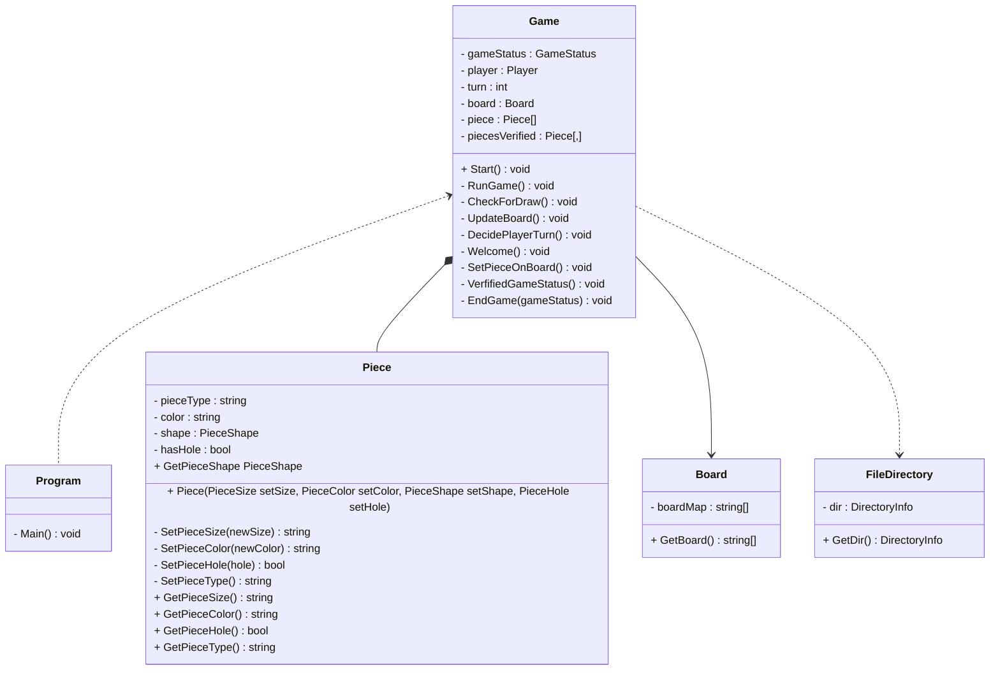

# Dungeon Crawler

### Autoria

#### Elementos do grupo:
- xxx
- Steven Hall 22001753
  
### _Report_:

#### XXX:
- Código:
  - _Bug fixing_
- Relatório: 40.0%
- UML: 50.0%

#### Steven: 
- Código: 
  - Classes  
   
  - Enumeradores
  - _Bug fixing_ 
- Relatório: 60.0%
- UML: 50.0%

## Arquitetura da solução
### Descrição da solução
- Projeto desenvolvido utilizando a linguagem _C#_ 8.0 e [_.NET_](https://learn.microsoft.com/en-us/dotnet/api/?view=netstandard-2.1).

### _UML_

## Referências 

### IAs generativas
  O uso de IAs generativas foi usado e neste tópico explicaremos como: 
- Utilizamos o _Chat Bing_ que utiliza o (_Chat GPT-4_) foi utilizado para tirar dúvidas e explicar itens da [_API_](https://learn.microsoft.com/en-us/dotnet/api/?view=netstandard-2.1) de forma mais clara e para erros simples. Como também para ter exemplos e obter de forma mais rápida _links_ com código útil.

### Consultas com docentes
  
A Realização deste projeto consistiu essencialmente em pesquisa própria, conhecimento adquirido por trabalhos e ensino fornecido por proferessores em diversas unidades curriculares lecionadas na [licenciatura de Videojogos](https://www.ulusofona.pt/lisboa/licenciaturas/videojogos).

O único docente com quem foi entrado em contacto para discutir questões relacionadas ao projeto, dúvidas, lógica e/ou eficiência do código foi ao professor Nuno Fachada.
#

### _Links_ de pesquisa utilizados para realização do projeto
* [_Getters & Setters_](https://www.w3schools.com/cs/cs_properties.php)
* [_C# Arrays W3 Schools_](https://www.w3schools.com/cs/cs_arrays.php)
* [_Tic Tac toe_ linhas, colunas e diagonal](https://www.c-sharpcorner.com/UploadFile/75a48f/tic-tac-toe-game-in-C-Sharp/)

* [Unicode Symbols](https://symbl.cc/en/unicode-table/)
* [Digrama UML Mermaid](https://mermaid.js.org/syntax/classDiagram.html)
* [_Mermaid Flowchart_](https://mermaid.js.org/syntax/flowchart.html)

#### _API_
* [_Arrays & Multidimensional Arrays_](https://learn.microsoft.com/en-us/dotnet/csharp/language-reference/builtin-types/arrays)
* [_Stream Reader & Error Handling_](https://learn.microsoft.com/en-us/dotnet/api/system.io.streamreader?view=netstandard-2.1)
* [_List_ ](https://learn.microsoft.com/en-us/dotnet/api/system.collections.generic.list-1?view=netstandard-2.1)
* [_List .Select_](https://learn.microsoft.com/en-us/dotnet/api/system.linq.enumerable.select?view=netstandard-2.1)
* [_PadRight(Int32)_](https://learn.microsoft.com/en-us/dotnet/api/system.string.padright?view=netstandard-2.1)
* [_ANSI Color codes_](https://www.lihaoyi.com/post/BuildyourownCommandLinewithANSIescapecodes.html)
* [_Envrionment.Exit(Int32)_](https://learn.microsoft.com/en-us/dotnet/api/system.environment.exit?view=netstandard-2.1)
*  [_Console.Clear()_](https://learn.microsoft.com/en-us/dotnet/api/system.console.clear?view=netstandard-2.1)

#### _Youtube_ (vídeos)
* [Planeamente Geral de classes, enumeradores](https://www.youtube.com/watch?v=NUNlVjt82m8&t=738s)
* [_Board class_](https://www.youtube.com/watch?v=Z1Zi41eiNGs&t=80s)
* [_Stream Reader_ exemplo](https://www.youtube.com/watch?v=tApBDuVwCrc)
---