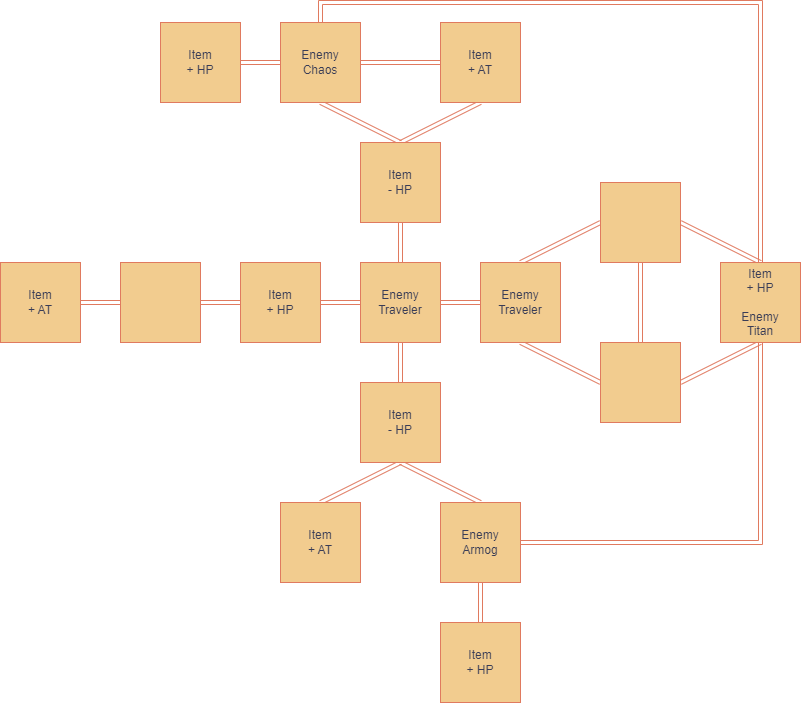
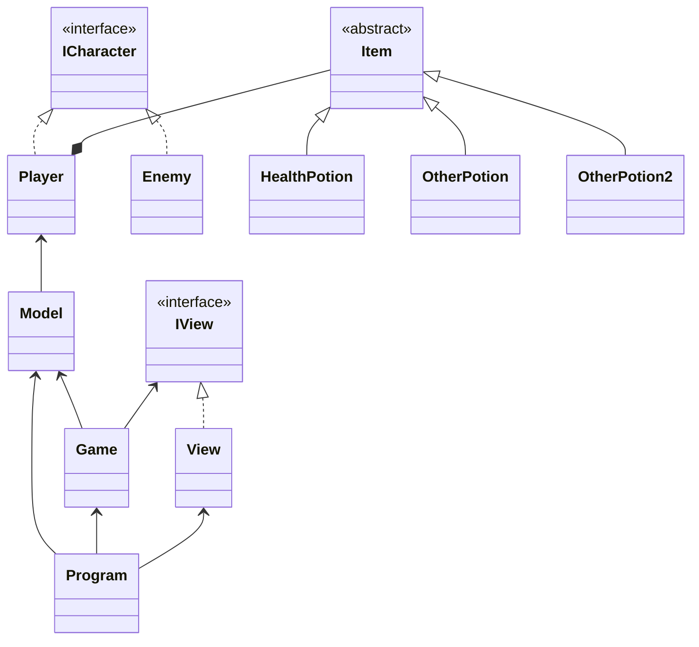

# LP1 // Projeto 2: *Yet Another Dungeon Crawler*

## Autoria

### Sónia Raposo 22000344

- Game Design
  - Jogador
  - Inimigos
  - Items
  - Mapa
- Código:
  - IView
  - View
  - Game
  - Model
  - Enemy
  - XML
  - *Bug fixing*
- Relatório: 90.0%
- UML: 65.0%

### Steven Hall 22001753

- Código:
  - Player
  - Enemy
  - Item
  - HealthPotion
  - AttackPotion
  - Model
  - Room
  - Game
  - View  
  - Program
  - IView
  - ICharacter
  - *Bug fixing*
- Relatório: 10.0%
- UML: 35.0%

## Arquitetura da solução

*Yet Another Dungeon Crawler* é uma aventura de texto

### Jogador

- **Health Points:** 1000
- **Attack Power:** 85 (Até 100 com item Heretic's Rage +5 AP)
- **Movimento:** North, South, West and East
- **Uso de items**: O jogador explora todas as salas após entrar. Quais quer items encontrado pelo jogador serão guardados no inventário e poderá usá-los a qualquer momento.
  - Use item: O efeito do item é imediatamente aplicado ao jogador.
  - Leave it alone: O jogador não é afetado pelo item.

### Inimigo: Traveler

- **Health Points:** 100
- **Attack Power:** 50

### Inimigo: Chaos

- **Health Points:** 250
- **Attack Power:** 130

### Inimigo: Armog

- **Health Points:** 350
- **Attack Power:** 100

### Inimigo (Boss): Titan

- **Health Points:** 500
- **Attack Power:** 125

### Item: God's Tear

- **Status:** Regenera + 250 HP ao jogador

### Item: Ivy's Flask

- **Status:** Inflige - 150 HP ao jogador

### Item: Heretic Rage

- **Status:** Adiciona permanentemente +5 Attack Power ao jogador

### Descrição da solução

Este projeto centra-se no desenvolvimento de um videojogo do genero *Dungeon Crawl* em consola, para ser realizado, foi utilizado a linguagem *C#* 8.0 e [*.NET Standard 2.1*](https://learn.microsoft.com/en-us/dotnet/api/?view=netstandard-2.1) que permitiu a criação de um simples jogo, onde é possível exploração de diferente salas, utilizar itens e combater inimigos

### Mapa
  

### *UML*

## Referências

### IAs generativas

O uso de IAs generativas foi usado e neste tópico explicaremos como:

- Utilizamos o *Chat Bing* que utiliza o (*Chat GPT-4*) foi utilizado para tirar dúvidas e explicar itens da [*API*](https://learn.microsoft.com/en-us/dotnet/api/?view=netstandard-2.1) de forma mais clara e para erros simples. Como também para ter exemplos e obter de forma mais rápida *links* com código útil.

### Consultas com docentes
  
A Realização deste projeto consistiu essencialmente em pesquisa própria, conhecimento adquirido por trabalhos e ensino fornecido por proferessores em diversas unidades curriculares lecionadas na [licenciatura de Videojogos](https://www.ulusofona.pt/lisboa/licenciaturas/videojogos).

O único docente com quem foi entrado em contacto para discutir questões relacionadas ao projeto, dúvidas, lógica e/ou eficiência do código foi ao professor Nuno Fachada relativamente a lógica de inicialização de salas, herança comum de personagens como *Player* e *Enemy* como também em relação a variáveis de suporte e sua respectiva utilidade.

### *Links* de pesquisa utilizados para realização do projeto

- [*Getters & Setters*](https://www.w3schools.com/cs/cs_properties.php)
- [*C# Arrays W3 Schools*](https://www.w3schools.com/cs/cs_arrays.php)
- [*Unicode Symbols*](https://symbl.cc/en/unicode-table/)
- [Digrama *UML Mermaid*](https://mermaid.js.org/syntax/classDiagram.html)

#### *API*

- [*Arrays & Multidimensional Arrays*](https://learn.microsoft.com/en-us/dotnet/csharp/language-reference/builtin-types/arrays)
- [*List*](https://learn.microsoft.com/en-us/dotnet/api/system.collections.generic.list-1?view=netstandard-2.1)
- [*PadRight(Int32)*](https://learn.microsoft.com/en-us/dotnet/api/system.string.padright?view=netstandard-2.1)
- [*ANSI Color codes*](https://www.lihaoyi.com/post/BuildyourownCommandLinewithANSIescapecodes.html)

- [*Console.Clear()*](https://learn.microsoft.com/en-us/dotnet/api/system.console.clear?view=netstandard-2.1)

- [*string.Join()*](https://learn.microsoft.com/en-us/dotnet/api/system.string.join?view=netstandard-2.1#system-string-join(system-char-system-object()))
- [*String.Contains()*](https://learn.microsoft.com/en-us/dotnet/api/system.string.contains?view=netstandard-2.1#system-string-contains(system-char))

#### *Youtube* (vídeos)

- [*Board class*](https://www.youtube.com/watch?v=Z1Zi41eiNGs&t=80s)

---
