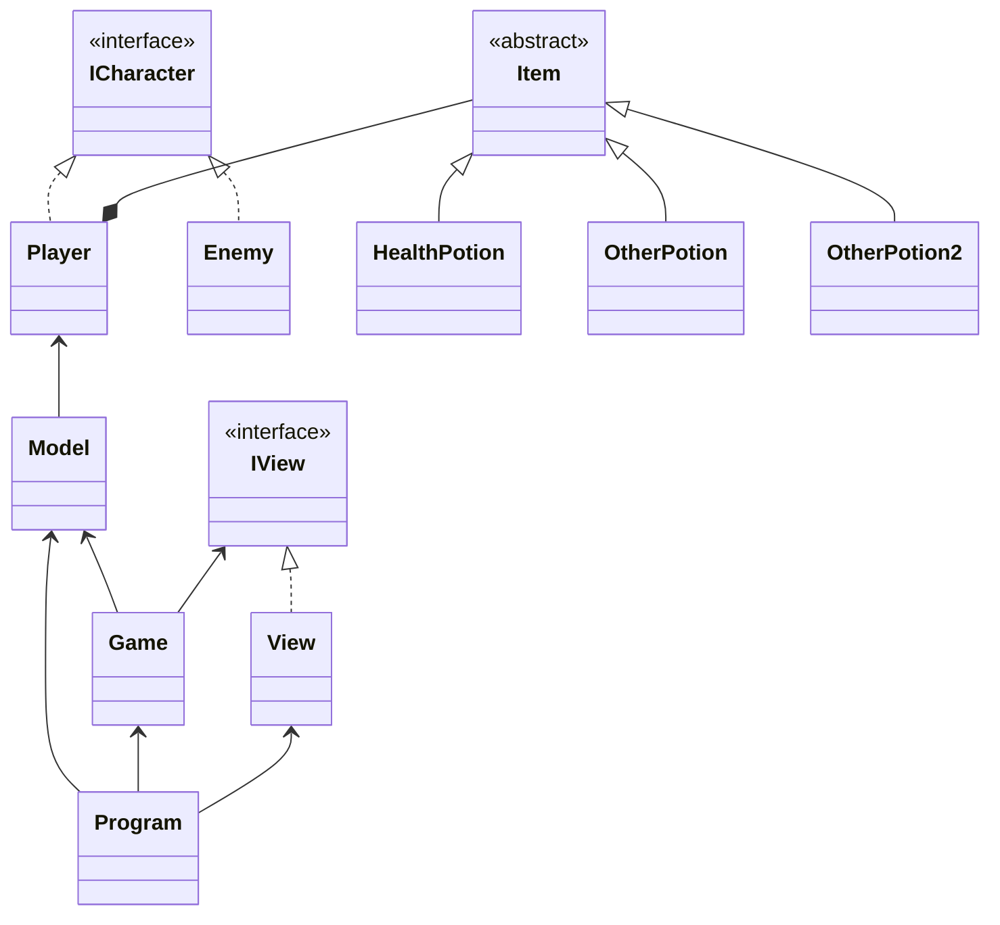

# LP1 // Projeto 2: *Yet Another Dungeon Crawler*

## Autoria

### Sónia Raposo 22000344

- Código:
  - _Bug fixing_
- Relatório: 40.0%
- UML: 50.0%

### Steven Hall 22001753

- Código:
  - Classes:
    - Player
    - Enemy
    - Item
    - HealthPotion
    - Model
    - Room
    - Game
    - View  
    - Program
  - Interfaces
    - IView
  - _Bug fixing_
- Relatório: 60.0%
- UML: 50.0%

## Arquitetura da solução

*Yet Another Dungeon Crawler*

### Jogador

- **Health Points:** 1000
- **Attack Power:** 85 (Até 100 com item Heretic's Rage +5 AP)
- **Movimento:** North, South, West and East
- **Uso de items**: O jogador explora todas as salas após entrar. Devido à natureza da Dungeon, o jogador nunca sabe o que é o item até escolher utilizá-lo.
  - Use item: O efeito do item é imediatamente aplicado ao jogador.
  - Leave it alone: O jogador não é afetado pelo item.

### Inimigo: Traveler

- **Health Points:** 100
- **Attack Power:** 50

### Inimigo: Chaos

- **Health Points:** 250
- **Attack Power:** 130

### Inimigo: Titan

- **Health Points:** 350
- **Attack Power:** 100
- 
### Inimigo: Boss?

- **Health Points:** ?
- **Attack Power:** ?

### Item: God's Tear

- **Status:** Regenera + 250 HP ao jogador

### Item: Ivy's Flask

- **Status:** Inflige - 150 HP ao jogador

### Descrição da solução

- Projeto desenvolvido utilizando a linguagem _C#_ 8.0 e [_.NET_](https://learn.microsoft.com/en-us/dotnet/api/?view=netstandard-2.1).

### _UML_

## Referências

### IAs generativas

  O uso de IAs generativas foi usado e neste tópico explicaremos como:

- Utilizamos o _Chat Bing_ que utiliza o (_Chat GPT-4_) foi utilizado para tirar dúvidas e explicar itens da [_API_](https://learn.microsoft.com/en-us/dotnet/api/?view=netstandard-2.1) de forma mais clara e para erros simples. Como também para ter exemplos e obter de forma mais rápida _links_ com código útil.

### Consultas com docentes
  
A Realização deste projeto consistiu essencialmente em pesquisa própria, conhecimento adquirido por trabalhos e ensino fornecido por proferessores em diversas unidades curriculares lecionadas na [licenciatura de Videojogos](https://www.ulusofona.pt/lisboa/licenciaturas/videojogos).

O único docente com quem foi entrado em contacto para discutir questões relacionadas ao projeto, dúvidas, lógica e/ou eficiência do código foi ao professor Nuno Fachada relativamente a lógica de inicialização de salas, herança comum de personagens como _Player_ e _Enemy_ como também em relação a variáveis de suporte e sua respectiva utilidade. 

### _Links_ de pesquisa utilizados para realização do projeto

- [_Getters & Setters_](https://www.w3schools.com/cs/cs_properties.php)

- [_C# Arrays W3 Schools_](https://www.w3schools.com/cs/cs_arrays.php)
- [_Tic Tac toe_ linhas, colunas e diagonal](https://www.c-sharpcorner.com/UploadFile/75a48f/tic-tac-toe-game-in-C-Sharp/)

- [Unicode Symbols](https://symbl.cc/en/unicode-table/)
- [Digrama UML Mermaid](https://mermaid.js.org/syntax/classDiagram.html)

#### _API_

- [_Arrays & Multidimensional Arrays_](https://learn.microsoft.com/en-us/dotnet/csharp/language-reference/builtin-types/arrays)

- [_Stream Reader & Error Handling_](https://learn.microsoft.com/en-us/dotnet/api/system.io.streamreader?view=netstandard-2.1)
- [_List_](https://learn.microsoft.com/en-us/dotnet/api/system.collections.generic.list-1?view=netstandard-2.1)
- [_List .Select_](https://learn.microsoft.com/en-us/dotnet/api/system.linq.enumerable.select?view=netstandard-2.1)
- [_PadRight(Int32)_](https://learn.microsoft.com/en-us/dotnet/api/system.string.padright?view=netstandard-2.1)
- [_ANSI Color codes_](https://www.lihaoyi.com/post/BuildyourownCommandLinewithANSIescapecodes.html)
- [_Envrionment.Exit(Int32)_](https://learn.microsoft.com/en-us/dotnet/api/system.environment.exit?view=netstandard-2.1)
- [_Console.Clear()_](https://learn.microsoft.com/en-us/dotnet/api/system.console.clear?view=netstandard-2.1)

- [_string.Join()_](https://learn.microsoft.com/en-us/dotnet/api/system.string.join?view=netstandard-2.1#system-string-join(system-char-system-object()))
  
- [_String.Contains()_](https://learn.microsoft.com/en-us/dotnet/api/system.string.contains?view=netstandard-2.1#system-string-contains(system-char))

#### _Youtube_ (vídeos)

- [Planeamente Geral de classes, enumeradores](https://www.youtube.com/watch?v=NUNlVjt82m8&t=738s)

- [_Board class_](https://www.youtube.com/watch?v=Z1Zi41eiNGs&t=80s)
- [_Stream Reader_ exemplo](https://www.youtube.com/watch?v=tApBDuVwCrc)

---
